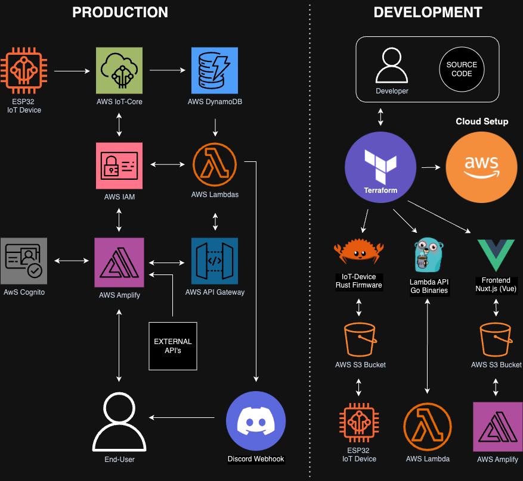

# IoT Terraform AWS Cloud

This IoT system is designed to collect, process, store, and display temperature and humidity data from an ESP32 IoT device, integrating seamlessly with **AWS** cloud services and a frontend application.

At the core of this project is **Terraform**, which serves as the backbone for Infrastructure As Code, **(IaC)** ensuring that all AWS resources are provisioned and deployed in a consistent, automated, and scalable manner.

### Production Environment

In production, the **ESP32** IoT device collects temperature and humidity readings and sends them to **AWS IoT Core** using MQTT.
Upon arrival, IoT Core adds a timestamp to the datapoint. The data is then routed to AWS DynamoDB using IoT Core Rules, where it is stored for further processing and retrieval.

**AWS DynamoDB** serves as the primary database, storing temperature, humidity, and timestamps.

**AWS Lambda** functions power the frontend UI by handling serverless processing and logic. The `iot_data` function retrieves and processes data from the database to deliver the necessary information to the UI, while the `devices` function serve device-status data using AWS IoT-Core Device Shadows.

Both functions are integrated with **AWS API Gateway**, which provides a structured REST API for seamless interaction with external systems and the frontend.

**AWS Amplify** connects the backend to the user-facing frontend and manages user authentication through AWS Cognito. Cognito ensures secure user interactions, while IAM handles permissions across all AWS resources, ensuring a scalable and secure architecture.

### Development Environment

The development workflow focuses on three main components:

- **IoT Device Firmware**, written in Rust, collects and transmits data from an ESP32 device.
- **Lambda API**, developed in Go, powers the Lambda functions that provide the frontend with data.
- **Frontend UI**, built with Nuxt.js and Vue, visualizes the data in clear, user-friendly dashboards.

To simplify development, artifacts like the Rust firmware, Go binaries, and frontend assets are compiled, zipped and stored in dedicated S3 buckets. These buckets make components easy to access and deploy. The frontend, hosted on AWS Amplify, uses the API Gateway to display real-time temperature and humidity data from the IoT devices.

This system provides an integrated solution, enabling seamless data flow from IoT devices to the AWS cloud. The data is processed and presented in intuitive dashboards and visualizations, giving users comprehensive and interactive insights.

## System Architechture Diagram



## Development Pre-requisites

While it is preferable to set up the development environments using tools like Devcontainers, this repository is designed to accommodate full flexibility instead.

This project is not tied to any CI/CD pipeline or repository-specific tools, allowing for flexibility in development.

Any integrated development environment (IDE) can be used, or even a minimal setup running directly from a USB stick with basic text editors like nano or vi, as long as Docker is installed in the environment for compilation and deployment.

### Required Applications

To set up and develop this project, you’ll need the following applications:

1. **[Docker](https://www.docker.com/products/docker-desktop/)**

### Optional Applications

These tools can enhance your development experience but are not strictly required:

1. **[Git](https://git-scm.com/downloads)**
2. **[Visual Studio Code (VS Code)](https://code.visualstudio.com/)**
3. **[Node.js](https://nodejs.org/)**
4. **[npm](https://docs.npmjs.com/downloading-and-installing-node-js-and-npm)**
5. **[Vue Devtools](https://devtools.vuejs.org/guide/installation.html)**

### Recommended VS Code Extensions

If you use VS Code as your IDE, the following extensions are recommended to improve your workflow:

1. **[Terraform](https://marketplace.visualstudio.com/items?itemName=hashicorp.terraform)**
2. **[Golang](https://marketplace.visualstudio.com/items?itemName=golang.Go)**
3. **[Rust Analyzer](https://marketplace.visualstudio.com/items?itemName=rust-lang.rust-analyzer)**
4. **[Prettier - Code Formatter](https://marketplace.visualstudio.com/items?itemName=esbenp.prettier-vscode)**
5. **[ESLint](https://marketplace.visualstudio.com/items?itemName=dbaeumer.vscode-eslint)**
6. **[Tailwind CSS IntelliSense](https://marketplace.visualstudio.com/items?itemName=bradlc.vscode-tailwindcss)**
7. **[Even Better TOML](https://marketplace.visualstudio.com/items?itemName=tamasfe.even-better-toml)**

## Setup AWS Account

1. Create [AWS](https://console.aws.amazon.com/) Account.
2. Go to [IAM Dashboard](https://console.aws.amazon.com/iam/) go to `Users`, click `Create user` and follow these steps:

   1. Specify **User name**
   2. Select **"Access key - Programmatic access"**.  
      Select **"Attach existing policies directly"**.  
      Select **"AdministratorAccess"** _(optionally, select each individual AWS service required)_.
   3. Review & Create **IAM User**.

3. Click your user in the IAM Dashboard and follow click `create access key`:

   1. Select **"Local code"**.
   2. Set tag such as _"Terraform access key for IoT project"_ f.e.
   3. Complete the setup and store both **Access Key** and **Secret Access Key** in a secure location.

4. Create a `.env` file in repository root and add the following variables:

```shell
# AWS Credentials
AWS_ACCOUNT_ID=your-account-id               # Replace!
AWS_DEFAULT_REGION=aws-default-region        # Replace!
AWS_ACCESS_KEY_ID=your-access-key-id         # Replace!
AWS_SECRET_ACCESS_KEY=your-secret-access-key # Replace!

# IoT Device Configuration
THING_NAME=your-iot-device-name # Replace!
WIFI_SSID=your-wifi-ssid         # Replace!
WIFI_PASSWORD=your-wifi-password # Replace!
MQTT_PORT=8883
MQTT_PUB_TOPIC=/telemetry
MQTT_SUB_TOPIC=/downlink
```

5. Go to the [Billing and Cost Management dashboard](https://console.aws.amazon.com/costmanagement/), and follow these steps:

   1. Go to **Budgets** and select `Create a budget`.
   2. Select either "Zero-Spend" (for testing with free-tier), or set a monthly spend limit.
   3. Enter the email address you want to get auto-alerts sent to.
   4. Create the Budget.

6. Test Access with **Terraform**:

Run the following commands to ensure Terraform can access AWS and configure resources based on the .env file.

```shell
docker-compose up --build terraform
```

## Terraform Output Files

Terraform generates several output files that are used for various tasks.

### Generated Files

```shell
# root directory
.amplify_app_url.txt

# iot-device/.certs
iot_cert.pem
iot_endpoint.txt
iot_private_key.pem
root_ca.pem

# frontend/.config
api-endpoints.json
cognito-config.json
```

## Deployment

If you plan to use this repository in a production environment with an active codebase, it is highly recommended to implement CI/CD scripts to automate and streamline the deployment process.

Below are the steps to manually build and deploy the components of this project:

```shell
# Generate API binaries
docker-compose up --build api

# Generate API-endpoints for frontend & certs for IoT-Device
docker-compose up --build terraform

docker-compose up --build nuxt-frontend # Build Frontend
docker-compose up --build esp32-rust # Build IoT-device Firmware

# Push frontend & IoT Firmware to AWS
docker-compose up --build terraform
```

Now access your app using the URL in `.amplify.url.txt`.

## Licence

As per licence file.
